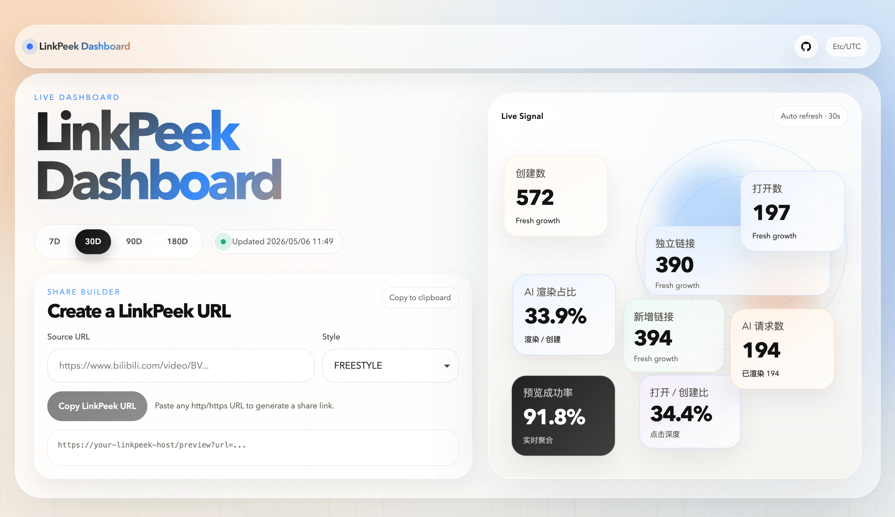

# LinkPeek

一个使用 Java 编写的链接预览代理服务，面向 iMessage 一类聊天分享场景，为受支持的第三方链接生成稳定的 Open Graph 预览页。

采用 `Spring Boot 3.x + Maven` 多模块结构，对外统一暴露 `GET /preview?url=...` 入口，内部通过 provider SPI 解析目标链接，并重点提供可配置的 AI 标题生成能力。



[在线体验 Live Demo](https://linkpeek.jianyutan.com/dashboard)
管理密码:linkpeek，在 Dashboard 连续按 3 下 6 弹出跳转按钮。

[Raycast Script](docs/linkpeek.sh)

[快捷指令 Shortcut](https://www.icloud.com/shortcuts/5cce870e64ff48e0853bd77485191fa7)

## 功能特点

- AI 标题生成：文本卡片可通过 Style Prompt 生成标题，支持 `FREESTYLE` 随机风格、AI Provider fallback、请求超时和自动降级。
- 统一预览入口：爬虫返回 Open Graph HTML，普通浏览器点击直接跳转原始链接。
- 多平台 provider：内置 Bilibili、GapHub、V2EX、NGA、LINUX DO，并保留 provider SPI 便于扩展。
- 稳定缓存链路：本地缓存元数据和缩略图，并对并发预览渲染做单飞去重。
- 运行时管理：`/admin` 可维护 Style Prompt、论坛 Cookie、AI Provider、服务日志和统计清理。
- 数据看板：Dashboard 展示创建、打开、失败、热门链接、AI 渲染占比和 AI 成功率。
- 自动化入口：Raycast Script 和 iOS Shortcut 可以直接生成 LinkPeek 分享链接。

## AI 标题生成

AI 标题生成是 LinkPeek 的核心增强能力：对 GapHub、V2EX、NGA、LINUX DO 等文本卡片，服务会在保留原始内容的基础上，根据后台配置的 Style Prompt 生成更适合分享场景的一行标题；Bilibili 等真实图片卡片仍使用原始图片预览。

- Style Prompt：控制标题风格，Style Key 保存和请求匹配都会统一转大写。
- `FREESTYLE`：系统保留风格，会从已配置的 Style Prompt 中随机选择一个；Dashboard 生成器默认使用它。
- Title Format Prompt：控制输出格式，Raw Content 始终作为独立 user message 放在最后。
- AI Provider：可配置多条上游服务，按启用状态和排序 fallback；每个 Provider 有独立请求超时。
- 自动降级：全局开启后，Provider 连续超时达到阈值会被移动到列表最后，并写入明显运行日志。
- 缓存隔离：AI styled 预览使用 `canonical URL + style + prompt hash` 生成独立 `PreviewKey`，不同风格不会互相污染缓存。

## 安装（Docker）

### 方式一：使用 `docker compose`

仓库已包含一个可直接启动的 `docker-compose.yml`：

```bash
docker compose up -d --build
```

默认监听 `8080` 端口。

建议生产环境至少配置：

- `BASE_URL`：服务对外可访问的地址，例如 `https://preview.example.com`
- `TZ`：容器时区，建议设为 `Asia/Shanghai`，让后端返回的 `timezone` 和统计窗口按北京时间计算
- `STATS_ADMIN_PASSWORD`：管理后台登录密码，配置后启用 `/admin`
- `/data` 持久化挂载：保存缓存、SQLite 数据库和日志

### 方式二：使用 `docker run`

```bash
docker build -t linkpeek .

docker run --rm \
  -p 8080:8080 \
  -e BASE_URL=https://preview.example.com \
  -e TZ=Asia/Shanghai \
  -e STATS_ADMIN_PASSWORD=change-me \
  -e WEB_ICON_PATH=/data/favicon.svg \
  -e CACHE_DIR=/data/cache \
  -e STATS_DB_PATH=/data/stats/linkpeek.db \
  -e CACHE_MAX_SIZE_GB=10 \
  -e PREVIEW_WARMUP_THREADS=2 \
  -e PREVIEW_WARMUP_QUEUE_CAPACITY=64 \
  -v "$PWD/data:/data" \
  linkpeek
```

### 生产部署建议

- 预览服务建议通过公网 `HTTPS` 暴露，提高即时通讯软件爬取成功率。
- 建议在前面放 `Nginx`  做 TLS、访问日志和基础限流。
- `/data` 目录建议整体持久化挂载，避免容器重建后缓存和统计数据全部丢失。

## 快速开始 / 使用示例

### 启动

```bash
docker compose up -d --build
```

生产部署时，把 `BASE_URL` 配置成服务公网地址，例如 `https://preview.example.com`。

### 生成预览链接

统一使用这个入口，把原始链接做 URL 编码后放进 `url` 参数即可，例如：

```text
https://preview.example.com/preview?url=https%3A%2F%2Fwww.v2ex.com%2Ft%2F1206093
```

文本卡片可以追加 `style` 触发 AI 标题生成。Dashboard 生成器默认使用 `FREESTYLE`；该模式会从后台已配置的 Style Prompt 中随机选择一个：

```text
https://preview.example.com/preview?url=https%3A%2F%2Fwww.v2ex.com%2Ft%2F1206093&style=FREESTYLE
```

常用入口：

| 地址 | 用途 |
| --- | --- |
| `/dashboard` | 统计看板和分享链接生成器 |
| `/admin/login` | 管理后台 |
| `/api/health` | 健康检查 |
| `/api/preview/support?url=...` | 判断当前链接是否支持预览 |
| `/doc.html` | OpenAPI 文档 |

支持判定示例：

```bash
curl -G --data-urlencode "url=https://www.v2ex.com/t/1206093" \
  https://preview.example.com/api/preview/support
```

模拟抓取器请求：

```bash
curl -A "facebookexternalhit/1.1" \
  "https://preview.example.com/preview?url=https%3A%2F%2Fwww.bilibili.com%2Fvideo%2FBV1xx411c7mD"
```

## 项目结构

```text
LinkPeek/
├── linkpeek-core/
│   └── 通用领域模型、错误模型、URL 规范化、provider SPI
├── linkpeek-provider-bilibili/
│   └── Bilibili URL 识别、短链解析、元数据抓取、缩略图下载
├── linkpeek-provider-gaphub/
│   └── GapHub 主题 URL 识别、HTML 元数据抓取、标题卡片生成
├── linkpeek-provider-linuxdo/
│   └── LINUX DO 主题 URL 识别、HTML 元数据抓取、标题卡片生成
├── linkpeek-provider-nga/
│   └── NGA 帖子 URL 识别、HTML 抓取、GBK 解码、标题卡片生成
├── linkpeek-provider-v2ex/
│   └── V2EX 话题 URL 识别、canonical 化、元数据抓取、标题卡片生成
├── linkpeek-provider-template/
│   └── provider 开发模板
├── linkpeek-server/
│   └── Spring Boot 服务、路由、缓存、HTML 渲染、管理后台、AI 标题生成
├── docs/
│   ├── architecture.md
│   ├── database-schema.md
│   ├── linkpeek.sh
│   └── provider-development.md
├── .github/workflows/ci.yml
├── Dockerfile
├── docker-compose.yml
├── mvnw
├── mvnw.cmd
└── pom.xml
```

各模块职责：

- `linkpeek-core`：定义 `PreviewProvider`、`PreviewMetadata`、`PreviewKey` 等核心抽象。
- `linkpeek-provider-bilibili`：封装 Bilibili 平台相关逻辑，不把平台细节泄漏到 Web 层。
- `linkpeek-provider-gaphub`：封装 GapHub 主题链接解析、HTML 元数据抓取和缩略图生成逻辑。
- `linkpeek-provider-linuxdo`：封装 LINUX DO 主题链接解析、HTML 元数据抓取和缩略图生成逻辑。
- `linkpeek-provider-nga`：封装 NGA 帖子 URL 识别、页面抓取、首楼摘要提取和缩略图生成逻辑。
- `linkpeek-provider-v2ex`：封装 V2EX 话题页解析、回复锚点归一化、AI 标题上下文补齐和标题卡片生成逻辑。
- `linkpeek-provider-template`：提供新增 provider 的最小骨架示例。
- `linkpeek-server`：负责 HTTP 接口、爬虫识别、缓存、OG HTML 输出、SQLite 统计、Dashboard 页面、管理后台和 AI 标题生成。

## 核心逻辑 / 关键流程

```text
/preview?url=<目标链接>&style=<可选风格>
        |
        v
校验 URL -> provider registry -> canonical URL -> 基础 PreviewKey
        |
        v
解析 style：空值走基础预览；普通 style 转大写匹配 Style Prompt；FREESTYLE 随机选择 Style Prompt
        |
        v
命中 Style Prompt 时生成 styled PreviewKey（canonical URL + style + prompt hash）
        |
        +-------------------------------+
        |                               |
        v                               v
     爬虫请求                         普通浏览器请求
        |                               |
        v                               v
缓存 / 单飞锁 / 抓取元数据              记录打开事件并 302 跳转原始链接
        |                               |
        |                               +--> 本地无元数据时投递有界异步预热
        v
文本卡片 + Style Prompt -> 调用 AI Provider 生成标题
        |
        v
AI Provider 按启用和排序 fallback，单 Provider 有独立请求超时；连续超时达到阈值可自动降级到列表最后
        |
        v
成功则缓存 styled 元数据；失败、空返回或真实图片卡片则回退基础元数据
        |
        v
渲染 Open Graph HTML，记录创建事件、AI 请求标记和 AI 成功标记
        |
        v
缩略图通过 /media/thumb/{previewKey}.jpg 按需下载与缓存
```

要点：

- 对外只有 `/preview` 一个分享入口，provider 负责平台识别、canonical 化和元数据解析。
- 基础预览和 AI styled 预览使用不同 `PreviewKey`，避免不同风格的标题互相污染缓存。
- 并发请求同一个 `PreviewKey` 时会复用同一把本地锁，避免未命中缓存时重复触发渲染任务。
- AI 标题只作用于文本卡片 provider；Bilibili 等真实图片卡片保持原图预览。
- Dashboard 的 AI 渲染占比口径是 `ai_succeeded_count / create_count`，AI 成功率是 `ai_succeeded_count / ai_requested_count`。

## 进阶用法

### 配置项

部署级配置通过环境变量提供；论坛登录态、提示词设置和 AI Provider 配置通过 `/admin` 写入同一个 SQLite 数据库。

| 变量名 | 默认值 | 说明 |
| --- | --- | --- |
| `PORT` | `8080` | HTTP 服务监听端口 |
| `BASE_URL` | `http://localhost:8080` | 生成预览资源绝对地址时使用的服务基础地址 |
| `TZ` | 系统时区 | 容器时区，建议设为 `Asia/Shanghai`，用于统计看板的时间基准和 `/api/stats/dashboard` 返回的 `timezone` |
| `WEB_ICON_PATH` | 空 | 可选的网页 favicon 文件路径，未配置或文件不存在时回退到内置 `DefaultIcon.svg` |
| `CACHE_DIR` | `/data/cache` | 本地缓存根目录 |
| `STATS_DB_PATH` | `/data/stats/linkpeek.db` | SQLite 统计库文件路径 |
| `CACHE_TTL_SECONDS` | `86400` | 元数据和缩略图缓存有效期 |
| `CACHE_MAX_SIZE_GB` | `10` | 缓存空间上限 |
| `STATS_RETENTION_DAYS` | `180` | 统计事件保留天数 |
| `STATS_ADMIN_PASSWORD` | 空 | 管理后台登录密码。配置后启用 `/admin`，用于清理统计数据和维护运行配置 |
| `DOWNLOAD_TIMEOUT` | `120s` | 上游请求超时时间 |
| `VIDEO_MAX_QUALITY` | `480` | 为未来视频能力预留，首版暂不启用 |
| `PREVIEW_WARMUP_ENABLED` | `true` | 是否启用普通浏览器打开后的异步元数据预热 |
| `PREVIEW_WARMUP_THREADS` | `2` | 异步元数据预热线程数 |
| `PREVIEW_WARMUP_QUEUE_CAPACITY` | `64` | 异步元数据预热队列上限，队列满时跳过本次预热 |
| `LOG_LEVEL` | `INFO` | 日志级别 |
| `LOG_FILE_PATH` | `/data/logs/linkpeek.log` | 服务滚动日志文件路径，也是后台日志查看功能的读取来源 |
| `LOG_FILE_MAX_SIZE` | `10MB` | 单个滚动日志文件上限 |
| `LOG_FILE_MAX_HISTORY` | `14` | 保留的滚动日志文件数量 |
| `LOG_FILE_TOTAL_SIZE_CAP` | `200MB` | 滚动日志总大小上限 |

### 管理后台

访问 `/admin/login` 使用 `STATS_ADMIN_PASSWORD` 登录，登录后进入 `/admin`。后台会签发 HttpOnly Cookie，`GET /api/admin/session` 仅用于页面刷新时确认当前登录状态，不返回敏感配置。

后台包含五个功能区：

- 提示词设置：维护 Title Format Prompt 和 `Style Key -> Style Prompt`。Style Key 保存和请求匹配都会统一转大写，`FREESTYLE` 是系统保留模式，会随机选择一个已配置 Style Prompt。
- AI 服务配置：维护 AI Provider 列表、启用状态、拖拽排序、请求超时、连通性测试和全局自动降级。自动降级按连续超时次数触发，会把对应 Provider 移动到列表最后。
- Provider 配置：维护 LinuxDo Cookie key/value（`_t`、`cf_clearance`、`_forum_session`）和 NGA 登录态（`NGA_PASSPORT_UID`、`NGA_PASSPORT_CID`）。这些值是运行时唯一来源，不再读取对应论坛环境变量。
- 服务日志：查看应用滚动文件日志，支持行数、级别、关键词筛选和自动刷新。
- 清理统计数据：调用 `POST /api/admin/stats/purge-all` 删除统计事件和链接聚合记录。

### 新增 provider

后续扩展新平台时，建议：

1. 在独立模块中实现 `PreviewProvider`
2. 补齐 `supports()`、`canonicalize()`、`resolve()`
3. 如有需要实现 `downloadThumbnail()`
4. 在 `linkpeek-server` 中注册为 Spring Bean

`supports()` 是服务端支持判定接口和 Raycast 脚本的唯一规则来源；新增 provider 并部署后，Raycast 用户不需要更新脚本。该方法必须只做快速 URL 形态判断，不访问上游、不写缓存、不记录统计。

参考文档：

- [架构说明](./docs/architecture.md)
- [数据库表结构](./docs/database-schema.md)
- [Provider 开发指南](./docs/provider-development.md)
- [TemplatePreviewProvider](./linkpeek-provider-template/src/main/java/io/github/shigella520/linkpeek/provider/template/TemplatePreviewProvider.java)

### 本地开发

本地构建与测试：

```bash
./mvnw -B verify
```

本地启动服务：

```bash
CACHE_DIR=$PWD/.cache/linkpeek \
STATS_DB_PATH=$PWD/.data/linkpeek/stats.db \
./mvnw -pl linkpeek-server -am spring-boot:run
```

如果你想显式指定端口，也可以这样启动：

```bash
CACHE_DIR=$PWD/.cache/linkpeek \
STATS_DB_PATH=$PWD/.data/linkpeek/stats.db \
./mvnw -pl linkpeek-server -am spring-boot:run \
  -Dspring-boot.run.arguments=--server.port=8080
```

### 常见问题：`PKIX path building failed`

如果本地日志里出现类似下面的错误：

```text
javax.net.ssl.SSLHandshakeException: PKIX path building failed
```

这通常不是 LinkPeek 的业务逻辑问题，而是当前 Java 运行时不信任你机器当前看到的 HTTPS 证书链。最常见的场景是：

- 开着公司/校园网代理
- 开着 Clash、Surge、Charles、Fiddler 之类的 HTTPS 代理或抓包工具
- `curl` 走的是系统证书，而 Java 17 走的是自己独立的 truststore

你现在这个现象就是典型例子：`curl` 能访问 `https://api.bilibili.com`，但 Java `HttpClient` 握手失败。

建议按下面顺序处理：

1. 先关闭系统代理、抓包工具或 HTTPS 中间人代理，再重试启动服务。
2. 如果必须经过代理，把代理根证书导出为 `ca.crt`，导入当前 JDK 的 truststore：

```bash
keytool -importcert \
  -alias local-proxy-ca \
  -file /path/to/ca.crt \
  -keystore "$JAVA_HOME/lib/security/cacerts"
```

默认密码通常是 `changeit`。

3. 如果你不想改全局 JDK，也可以单独给本次启动指定 truststore：

```bash
CACHE_DIR=$PWD/.cache/linkpeek ./mvnw -pl linkpeek-server -am spring-boot:run \
  -Dspring-boot.run.arguments=--server.port=8080 \
  -Dspring-boot.run.jvmArguments='-Djavax.net.ssl.trustStore=/path/to/truststore.jks -Djavax.net.ssl.trustStorePassword=changeit'
```

4. 导入证书后，可以先用下面的命令验证 Java 侧是否恢复正常：

```bash
curl -A "facebookexternalhit/1.1" \
  "http://localhost:8080/preview?url=https%3A%2F%2Fwww.bilibili.com%2Fvideo%2FBV1McSQBEE71"
```

如果页面不再返回 `Preview Error`，说明证书链问题已经解决。

## 许可证

本项目使用 [MIT License](./LICENSE)。

这意味着：

- 允许自由使用、修改、分发和商用
- 只需保留原始版权声明和许可证文本
- 适合个人项目、开源项目和商业内部项目使用

## 友情链接

<p align="center">
  <a href="https://linux.do" target="_blank">
    
  </a>
</p>
