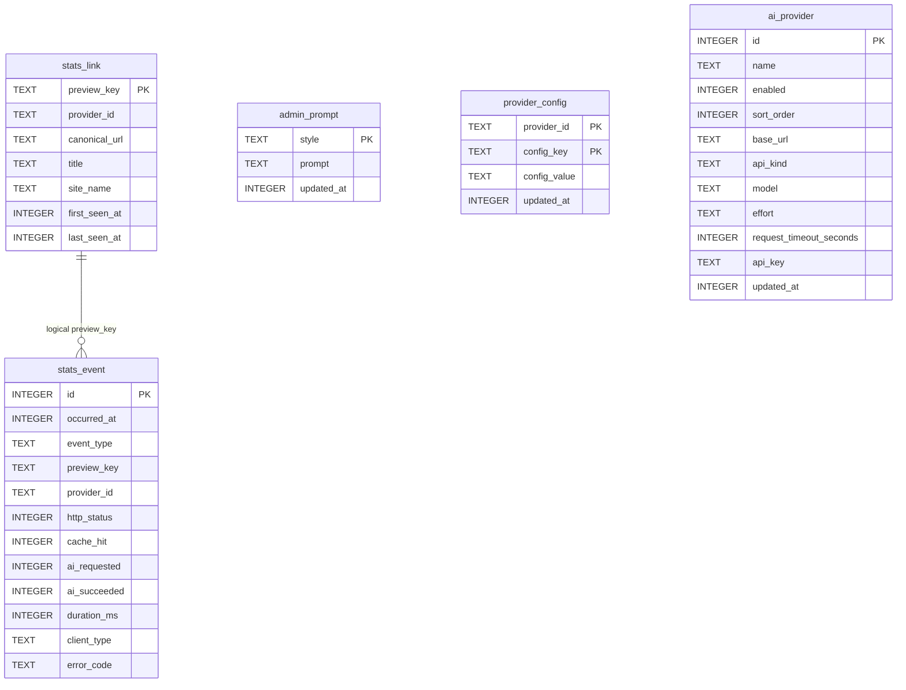

# 数据库表结构

LinkPeek 运行时使用一个 SQLite 数据库，默认路径由 `STATS_DB_PATH` 指定为 `/data/stats/linkpeek.db`。

数据库同时承载两类数据：

- 统计数据：预览事件、链接聚合记录、Dashboard 查询数据来源。
- 管理后台运行配置：Style Prompt、论坛 Cookie、AI Provider 列表、AI 标题格式和 AI Provider 自动降级配置。

当前 schema 的代码来源是 `linkpeek-server/src/main/resources/db/stats-schema.sql`。启动时会执行该 schema，并由 `StatisticsConfiguration` 做少量幂等迁移。

## 总览

注意：当前 SQLite schema 没有声明物理外键，运行配置中也关闭了 foreign key enforcement。上图表达的是代码层面的逻辑关系。

## 约定

- 所有时间字段都是 epoch milliseconds。
- SQLite 没有布尔类型，代码使用 `INTEGER` 保存布尔值：`0=false`，`1=true`。
- `provider_id` 有两种含义：
  - 统计表中的 `provider_id` 是内容 provider，例如 `bilibili`、`gaphub`、`v2ex`、`linuxdo`、`nga`。
  - `provider_config.provider_id` 是配置命名空间，例如 `linuxdo`、`nga`、`ai_title`、`ai_provider`。
- AI Provider 是管理后台配置的上游 AI 服务，保存在 `ai_provider` 表；它和内容 provider 不是同一个概念。

## stats_link

链接聚合维表，用于 Dashboard 的热门链接、标题展示、首次/最近出现时间等查询。

| 字段 | 类型 | 约束 | 说明 |
| --- | --- | --- | --- |
| `preview_key` | `TEXT` | PK | 预览资源稳定标识。基础预览来自 canonical URL；AI styled 预览来自 canonical URL、style 和 prompt hash。 |
| `provider_id` | `TEXT` | 可空 | 内容 provider ID。失败事件或极早期记录可能为空。 |
| `canonical_url` | `TEXT` | NOT NULL | provider 归一化后的目标 URL。 |
| `title` | `TEXT` | NOT NULL | 展示标题。事件只记录打开但尚无元数据时可能先写空字符串，后续 upsert 会用真实标题补齐。 |
| `site_name` | `TEXT` | NOT NULL | 站点名，例如 `Bilibili`、`V2EX`。 |
| `first_seen_at` | `INTEGER` | NOT NULL | 首次出现时间。 |
| `last_seen_at` | `INTEGER` | NOT NULL | 最近出现时间。 |

索引：

- `idx_stats_link_last_seen_at(last_seen_at)`

写入规则：

- 通过 `StatsLinkMapper.upsertLink` 写入。
- 冲突时保留更早的 `first_seen_at`，更新更晚的 `last_seen_at`。
- 新写入的标题或站点名为空时，不覆盖已有非空值。

## stats_event

统计事件事实表，记录预览创建、打开、失败和缩略图服务事件。

| 字段 | 类型 | 约束 | 说明 |
| --- | --- | --- | --- |
| `id` | `INTEGER` | PK AUTOINCREMENT | 自增事件 ID。 |
| `occurred_at` | `INTEGER` | NOT NULL | 事件发生时间。 |
| `event_type` | `TEXT` | NOT NULL | 事件类型。当前包括 `PREVIEW_CREATED`、`PREVIEW_OPENED`、`PREVIEW_FAILED`、`THUMBNAIL_SERVED`。 |
| `preview_key` | `TEXT` | 可空 | 逻辑关联 `stats_link.preview_key`。URL 非法等场景可能为空。 |
| `provider_id` | `TEXT` | 可空 | 内容 provider ID。 |
| `http_status` | `INTEGER` | NOT NULL | 本次服务响应状态码。 |
| `cache_hit` | `INTEGER` | NOT NULL | 是否命中元数据或缩略图缓存。 |
| `ai_requested` | `INTEGER` | NOT NULL DEFAULT 0 | 本次预览创建是否请求过 AI 标题。 |
| `ai_succeeded` | `INTEGER` | NOT NULL DEFAULT 0 | 本次 AI 标题是否成功生成并用于预览。 |
| `duration_ms` | `INTEGER` | NOT NULL | 服务端处理耗时。 |
| `client_type` | `TEXT` | NOT NULL | 客户端类型，例如 crawler、browser、media 等枚举值。 |
| `error_code` | `TEXT` | 可空 | 失败分类，例如 `INVALID_URL`、`UNSUPPORTED_URL`、`UPSTREAM_ERROR`、`OTHER`。 |

索引：

- `idx_stats_event_occurred_at(occurred_at)`
- `idx_stats_event_type_occurred_at(event_type, occurred_at)`
- `idx_stats_event_preview_key(preview_key)`

关系和清理：

- `preview_key` 逻辑关联 `stats_link.preview_key`，但不强制外键。
- 统计过期清理会先删除旧事件，再删除没有事件引用的孤儿 `stats_link`。
- 管理后台清理全部统计数据会删除 `stats_event` 和 `stats_link`，不会删除后台配置。

## admin_prompt

Style Prompt 表，管理后台通过它维护 `style -> prompt`。

| 字段 | 类型 | 约束 | 说明 |
| --- | --- | --- | --- |
| `style` | `TEXT` | PK | 样式名。代码限制为 1-64 位，允许字母、数字、点、下划线和短横线。 |
| `prompt` | `TEXT` | NOT NULL | 该 style 对应的风格提示词。 |
| `updated_at` | `INTEGER` | NOT NULL | 最近更新时间。 |

使用方式：

- `/preview?url=...&style=...` 会先根据 `style` 查找该表。
- 命中后，Style Prompt 作为独立 user message 发送给 AI Provider。
- 公开接口 `/api/preview/styles` 只返回 style 名称，不返回 prompt 内容。

## provider_config

通用运行配置 KV 表。主键是 `(provider_id, config_key)`。

| 字段 | 类型 | 约束 | 说明 |
| --- | --- | --- | --- |
| `provider_id` | `TEXT` | PK | 配置命名空间，不一定是内容 provider。 |
| `config_key` | `TEXT` | PK | 配置项 key。 |
| `config_value` | `TEXT` | NOT NULL | 配置值，统一按字符串存储。 |
| `updated_at` | `INTEGER` | NOT NULL | 最近更新时间。 |

当前代码会写入和读取的配置命名空间与 key：

| provider_id | config_key | 写入入口 | 含义和读取逻辑 |
| --- | --- | --- | --- |
| `linuxdo` | `_t` | 管理后台论坛配置，`PUT /api/admin/provider-config/linuxdo`。 | LinuxDo Cookie `_t`。`ProviderConfigService.linuxDoCookieHeader()` 读取后拼入上游请求 Cookie。保存值会 `strip()`；生成 Cookie header 时允许用户粘贴完整 `_t=...; Path=...`，代码会截取第一个分号前的真实 cookie 值。 |
| `linuxdo` | `cf_clearance` | 管理后台论坛配置，`PUT /api/admin/provider-config/linuxdo`。 | LinuxDo Cloudflare Cookie `cf_clearance`。读取和清洗逻辑同 `_t`。 |
| `linuxdo` | `_forum_session` | 管理后台论坛配置，`PUT /api/admin/provider-config/linuxdo`。 | LinuxDo Cookie `_forum_session`。读取和清洗逻辑同 `_t`。 |
| `nga` | `NGA_PASSPORT_UID` | 管理后台论坛配置，`PUT /api/admin/provider-config/nga`。 | NGA 登录态 UID。`ProviderConfigService.ngaPassportUid()` 读取，空字符串视为未配置。 |
| `nga` | `NGA_PASSPORT_CID` | 管理后台论坛配置，`PUT /api/admin/provider-config/nga`。 | NGA 登录态 CID。`ProviderConfigService.ngaPassportCid()` 读取，空字符串视为未配置。 |
| `ai_title` | `title_format_prompt` | AI 标题格式配置，`PUT /api/admin/ai-title-config`。 | AI 标题输出格式提示词。`AiTitleConfigService.titleFormatPrompt()` 读取后作为 AI 标题生成的 system/instructions；没有记录时使用代码内置默认提示词。 |
| `ai_provider` | `auto_downgrade_enabled` | AI Provider 自动降级配置，`PUT /api/admin/ai-provider-downgrade-config`。 | AI Provider 自动降级全局开关，字符串 `true`/`false`。`AiProviderDowngradeService.config()` 读取；没有记录或空值时默认为 `false`。 |
| `ai_provider` | `auto_downgrade_timeout_threshold` | AI Provider 自动降级配置，`PUT /api/admin/ai-provider-downgrade-config`。 | AI Provider 自动降级全局连续超时阈值。`AiProviderDowngradeService.config()` 读取；默认 `3`，允许 `1..100`，非法数字读取时回退默认值，保存时越界会返回 400。 |

注意：

- 通用接口 `PUT /api/admin/provider-config/{providerId}` 没有 key 白名单，传入的 `values` 会逐项 upsert 到 `provider_config`。当前后台 UI 固定写入上表中的 LinuxDo/NGA Cookie key；如果 API 额外写入 `linuxdo` 下的其他 key，`linuxDoCookieHeader()` 会把它们作为额外 Cookie 附加到 header。
- `auto_downgrade_enabled` 和 `auto_downgrade_timeout_threshold` 是全局配置，不是 `ai_provider` 表字段。
- 自动降级的连续超时计数保存在进程内存中，服务重启后会清空。
- Cookie 和提示词以明文保存，应保护 SQLite 文件权限和后台访问权限。

## ai_provider

AI Provider 列表，用于 AI 标题生成。代码会按 `enabled=1`、`sort_order ASC`、`id ASC` 依次尝试。

| 字段 | 类型 | 约束 | 说明 |
| --- | --- | --- | --- |
| `id` | `INTEGER` | PK AUTOINCREMENT | AI Provider 自增 ID。 |
| `name` | `TEXT` | NOT NULL | 管理后台展示名。 |
| `enabled` | `INTEGER` | NOT NULL | 是否启用。列表页可直接启用/禁用。 |
| `sort_order` | `INTEGER` | NOT NULL | 排序号。后台拖拽排序会重写为 `100, 200, 300...`。 |
| `base_url` | `TEXT` | NOT NULL | AI API 基础地址，通常填到 `/v1`，例如 `https://api.openai.com/v1`。 |
| `api_kind` | `TEXT` | NOT NULL DEFAULT `CHAT_COMPLETIONS` | API 格式。当前支持 `CHAT_COMPLETIONS` 和 `RESPONSES`。 |
| `model` | `TEXT` | NOT NULL | 模型名。 |
| `effort` | `TEXT` | 可空 | 推理 effort。Responses 写入 `reasoning.effort`，Chat Completions 写入 `reasoning_effort`。 |
| `request_timeout_seconds` | `INTEGER` | NOT NULL DEFAULT 45 | 该 AI Provider 的请求超时秒数，管理后台限制 `1..600`。 |
| `api_key` | `TEXT` | NOT NULL | API Key，当前按后台要求明文返回和保存。 |
| `updated_at` | `INTEGER` | NOT NULL | 最近更新时间。 |

索引：

- `idx_ai_provider_enabled_sort(enabled, sort_order, id)`

排序规则：

- 新建 Provider 默认追加到当前最大 `sort_order + 100`。
- 手工拖拽排序和自动降级都会重写列表排序为 `100, 200, 300...`。
- 自动降级触发时，对应 Provider 会被移动到列表最后；即使已经在最后，也会写入明显 WARN 日志。

## 逻辑关系

### stats_event -> stats_link

- `stats_event.preview_key` 逻辑关联 `stats_link.preview_key`。
- 写事件时，如果有 `preview_key` 和 `canonical_url`，代码会先 upsert `stats_link`，再 insert `stats_event`。
- 失败事件可能没有 `preview_key`，因此该字段可空。

### admin_prompt -> styled PreviewKey

- `admin_prompt.style` 被 `/preview` 的 `style` 参数引用。
- Style Prompt 不直接关联统计表。
- AI styled 元数据使用独立 `PreviewKey`，所以 styled preview 的统计会进入独立的 `stats_link.preview_key`。

### provider_config -> 运行模块

- `provider_config` 是通用 KV 表，没有固定外键。
- `linuxdo` 和 `nga` 命名空间由内容 provider 读取，用于上游论坛登录态。
- `ai_title` 命名空间由 AI 标题配置读取。
- `ai_provider` 命名空间由 AI Provider 自动降级服务读取。

### ai_provider -> AI 请求

- `ai_provider` 不和 `stats_event.provider_id` 建立关系。
- `stats_event.provider_id` 记录的是内容 provider；AI Provider 的使用情况目前通过运行日志观测。
- AI Provider 自动降级只改 `ai_provider.sort_order`，不会禁用 Provider，也不会写统计事件。

## 迁移策略

当前项目没有版本化 migration 工具。启动时会做两步：

1. 执行 `db/stats-schema.sql` 中的 `CREATE TABLE IF NOT EXISTS` 和 `CREATE INDEX IF NOT EXISTS`。
2. 执行 `StatisticsConfiguration` 里的幂等列迁移。

当前幂等迁移包括：

| 表 | 字段 | 定义 |
| --- | --- | --- |
| `stats_event` | `ai_requested` | `INTEGER NOT NULL DEFAULT 0` |
| `stats_event` | `ai_succeeded` | `INTEGER NOT NULL DEFAULT 0` |
| `ai_provider` | `request_timeout_seconds` | `INTEGER NOT NULL DEFAULT 45` |

添加新字段时，应同时更新：

- `linkpeek-server/src/main/resources/db/stats-schema.sql`
- `StatisticsConfiguration` 中的幂等迁移逻辑
- 对应 MyBatis mapper、model 和测试
- 本文档

## 维护注意事项

- 不要把 AI Provider 自动降级开关和阈值加到 `ai_provider` 表；它们是全局策略，属于 `provider_config(provider_id='ai_provider')`。
- 不要把内容 provider ID 和 AI Provider ID 混用。前者是字符串平台标识，后者是 `ai_provider.id` 自增数字。
- 新增统计事件类型或错误码时，要同步检查 Dashboard 聚合 SQL 和前端展示。
- 新增后台运行配置时，优先复用 `provider_config`；只有需要列表、排序或复杂字段时再考虑新表。
